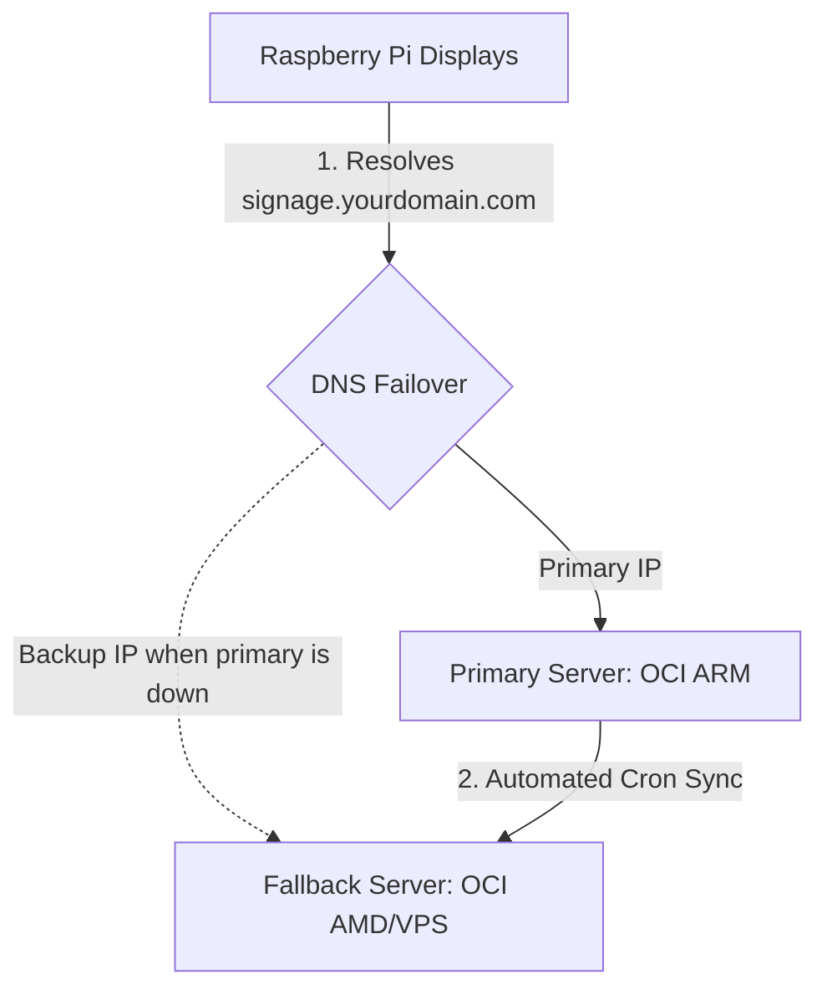

# Open Source Signage — Backup & Fallover Infrastructure Guide

This guide details how to implement a high-availability infrastructure-level failover for your self-hosted digital signage platform using **DNS Failover** and **automated data synchronization**.

By choosing this architecture (Option B), you avoid modifying the Raspberry Pi agent software, ensuring displays remain stable and run standard code while traffic automatically diverts to a fallback node if the primary goes offline.

---



---

## Phase 1: DNS-Level Failover Configuration

To make failover seamless, you must use a single host domain (e.g., `signage.yourdomain.com`) configured with a DNS service that supports automated health checks.

### Recommended Providers:
1. **Cloudflare (Load Balancer & Failover)**:
   * Create a Load Balancer under **Traffic → Load Balancing**.
   * Define two pools: **Primary Pool** (containing your OCI ARM server IP) and **Fallback Pool** (containing your fallback VPS IP).
   * Configure an HTTP health check pointing to `https://YOUR_DOMAIN/api/health`.
   * Set routing to fail over to the secondary pool if health checks fail.
2. **AWS Route 53 (Failover Routing)**:
   * Create health checks monitoring the primary IP address.
   * Configure two DNS records for `signage.yourdomain.com`:
     * **Primary**: Failover routing policy, linked to the primary server health check.
     * **Secondary**: Failover routing policy, acting as the secondary target.

---

## Phase 2: Automated Database & Media Synchronization

To ensure the fallback server recognizes displays, JWT sessions, and playlists, we need to regularly clone database records and uploaded media files from the primary node.

We can automate this using a secure daily synchronization pipeline.

### Step 1: Create a Restore Script on the Fallback Server
On your **Fallback Server**, create a script named `/home/ubuntu/restore_backup.sh` to extract database dumps and media archives:

```bash
#!/bin/bash
# /home/ubuntu/restore_backup.sh
set -e

BACKUP_DIR="/home/ubuntu/signage_backups"
LATEST_BACKUP=$(ls -t $BACKUP_DIR/signage_backup_*.tar.gz | head -n 1)
TEMP_DIR="/tmp/signage_restore"

if [ -z "$LATEST_BACKUP" ]; then
    echo "No backup archive found to restore."
    exit 1
fi

echo "=== Restoring Signage Backup: $LATEST_BACKUP ==="
rm -rf "$TEMP_DIR" && mkdir -p "$TEMP_DIR"
tar -xzf "$LATEST_BACKUP" -C "$TEMP_DIR"

# 1. Restore PostgreSQL Database
echo "Restoring database schema and data..."
docker exec -i signage-postgres-1 psql -U signage -d signage < "$TEMP_DIR/db_dump.sql"

# 2. Restore Media Files
echo "Restoring media volume..."
docker run --rm --volumes-from signage-server-1 -v "$TEMP_DIR:/backup" alpine tar -xzf /backup/media.tar.gz -C /

rm -rf "$TEMP_DIR"
echo "=== Restore Completed ==="
```
*Make the restore script executable:* `chmod +x /home/ubuntu/restore_backup.sh`

### Step 2: Establish Passwordless SSH Access
The primary server needs to copy backup files to the fallback server securely.
1. Generate an SSH keypair on the **Primary Server** (if not already present):
   ```bash
   ssh-keygen -t ed25519 -N "" -f ~/.ssh/id_ed25519
   ```
2. Copy the key to the **Fallback Server's** authorized hosts:
   ```bash
   ssh-copy-id ubuntu@FALLBACK_SERVER_IP
   ```

### Step 3: Automate Synchronization with Cron
On the **Primary Server**, edit the cron table (`crontab -e`) to run the backup, transfer it, and restore it automatically at 2:00 AM every night:

```cron
0 2 * * * /home/ubuntu/signage/signage/backup.sh && LATEST_FILE=$(ls -t /home/ubuntu/signage_backups/signage_backup_*.tar.gz | head -n 1) && scp $LATEST_FILE ubuntu@FALLBACK_SERVER_IP:/home/ubuntu/signage_backups/ && ssh ubuntu@FALLBACK_SERVER_IP "/home/ubuntu/restore_backup.sh"
```

---

## Phase 3: Secondary Server Configuration Checklist

To guarantee the fallback server handles agent connections correctly, verify the following configuration matches the primary server:

1. **Environmental Variables (`.env`)**:
   * Confirm the `JWT_SECRET`, `REFRESH_SECRET`, and `DB_PASSWORD` in `/home/ubuntu/signage/signage/.env` on the fallback server match the primary server exactly. If secrets differ, JWT authentication will fail during switchover.
2. **Nginx SSL Certificates**:
   * Copy the Let's Encrypt certificates directory (`/etc/letsencrypt`) from the primary to the fallback server to ensure Nginx can launch with the correct HTTPS credentials:
     ```bash
     rsync -avz --delete /etc/letsencrypt/ ubuntu@FALLBACK_SERVER_IP:/etc/letsencrypt/
     ```
3. **Open System Firewall Ports**:
   * Open port `80` and `443` in the fallback server security lists/firewall (`iptables`) as shown in the README to ensure displays can reach the backup node.

---

## Recovery Workflow (Display Offline Cache Safety Net)

In the event of a catastrophic primary server failure:
1. **Instant Offline Playback**: The Raspberry Pi displays will instantly notice the server disconnection and drop into offline mode, looping the current playlist from their local cache. Screens will not go black.
2. **DNS Shift**: The DNS routing resolves the host to the fallback server.
3. **Agent Connection**: Displays connect to the fallback server. Because database sessions and registration keys are synchronized nightly, the displays authenticate and continue checking for playlist updates without manual intervention.
